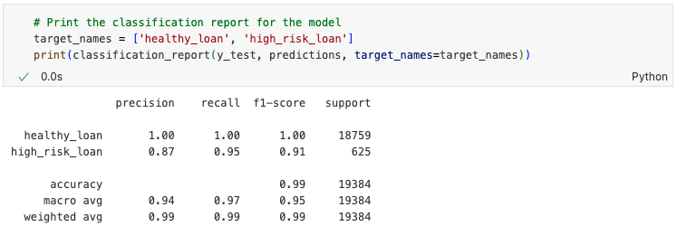

# Module-20-Challenge

## Overview of the Analysis

The purpose of this analysis is to build a supervised machine learning model to identify and predict class 0 (healthy loan) and class 1 (high-risk loan) based on the provided historical lending data. A logistic regression model was created, and the dataset used to train the model includes financial information such as the loan size, interest rate, borrower's income, debt-to-income ratio, number of accounts, derogatory marks, and total debt. The target variable is to predict the loan_status, which is either `loan_status 0 (healthy loan)` or `loan_status 1 (high-risk loan)`.

For this analysis, I went through the following stages of the machine learning process:

- Read the provided CSV file into a Pandas dataframe.
- Separated the dataframe into labels (y) and features (X) sets.
- Split the data into training (X_train, y_train) and testing (X_test, y_test) datasets for model training and validating purpose.
- Created a logistic regression model and trained it using the training data (X_train, y_train).
- Made predictions on the testing dataset (X_test) using the trained model.
- Evaluated the performance of the trained model using a confusion matrix and a classification report.

## Results

Below is a screenshot of the classification report showing the accuracy, precision, and recall scores.

- Accuracy Score
  - The overall accuracy is 0.99, meaning the model correctly predicted 99% of the instances.

- Precision Score
  - **Healthy Loan**: precision score is 1.00, indicating 100% of the predictions labeled as healthy loan are correct.
  - **High-risk Loan**: precision score is 0.87, indication 87% of the predictions labeled as high-risk loan are predicted correctly.

- Recall Score
  - **Healthy Loan**: recall score is 1.00, indicating 100% of all actual healthy loans are identified by the model correctly.
  - **High-risk Loan**: recall score is 0.95, indicating 95% of all actual high-risk loans are identified by the model correctly.

## Summary

The overall performance of the machine learning model is pretty good, with an accuracy score of 0.99. I would recommend this model to the company for detecting high-risk loans based on the precision score of 0.87 and recall score of 0.95. However, I also suggest further tuning before deploying the model, as the slightly worse performance in predicting high-risk loans could cause some financial losses for the company.

Possible further tuning suggestions include:

- Using the imbalanced-learn library to solve the imbalanced dataset issue. The provided historical lending data contains 75,036 instances of class 0 (healthy loan) but only 2,500 instances of class 1 (high-risk loan).
- Applying the `StandardScaler()` method during the preprocessing stage. Since the dataset contains both large and small numerical values, scaling may improve the model's performance.

## Resources

Resources that I referred to for completing this homework:

<https://chatgpt.com/>